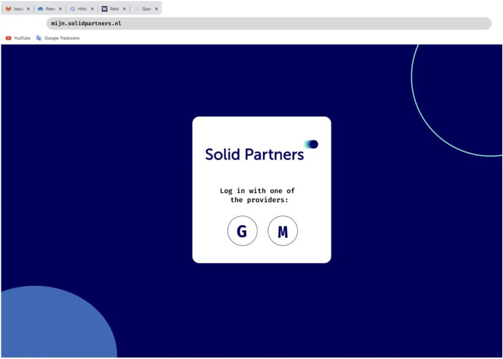
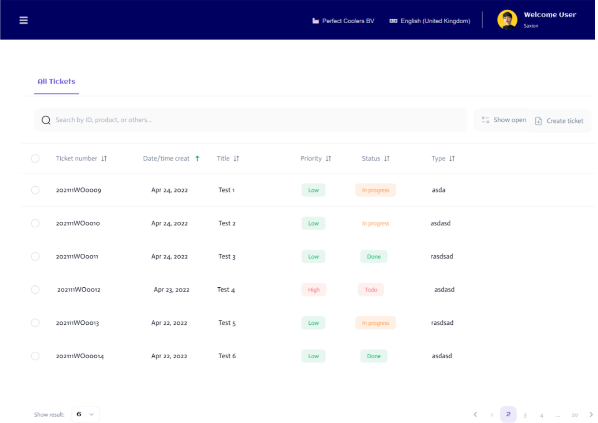
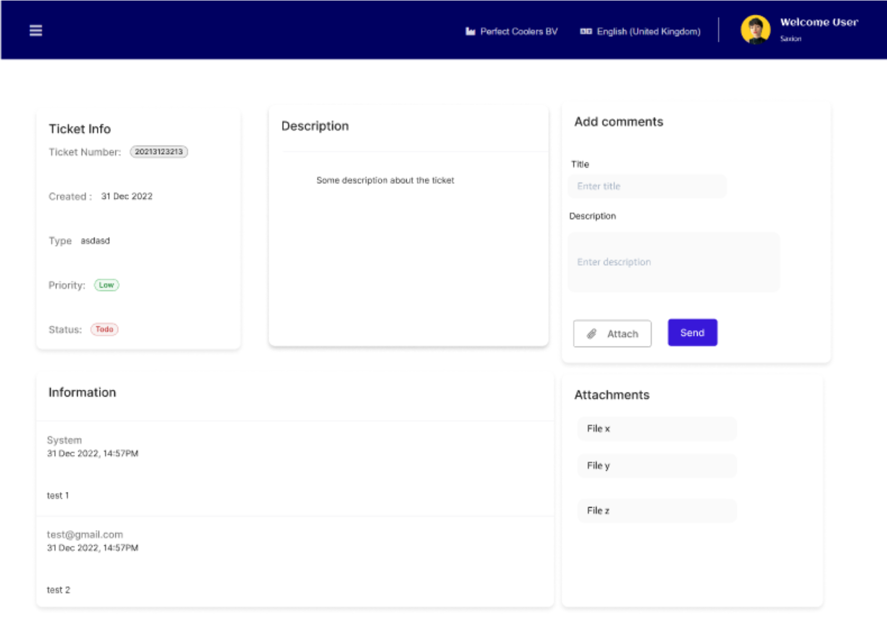
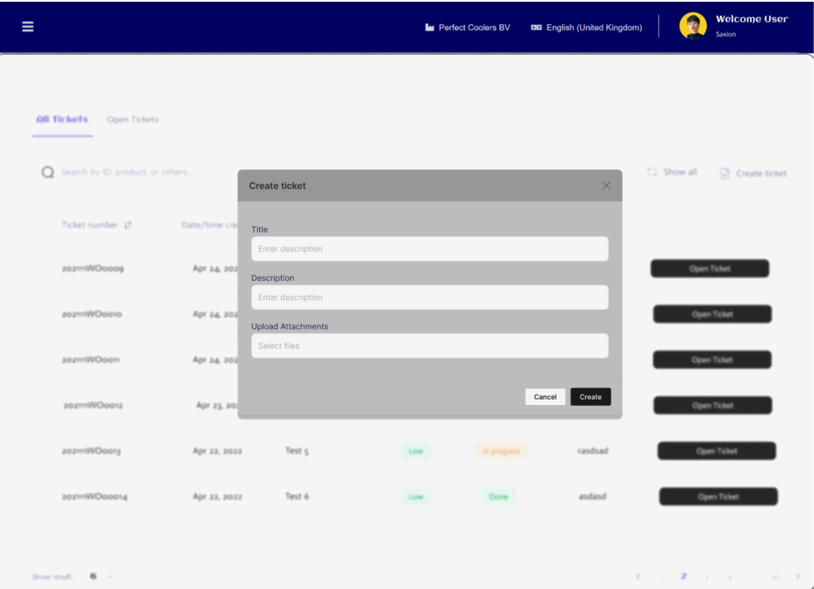
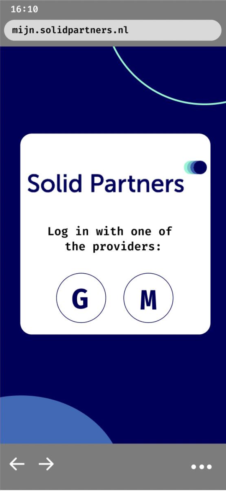
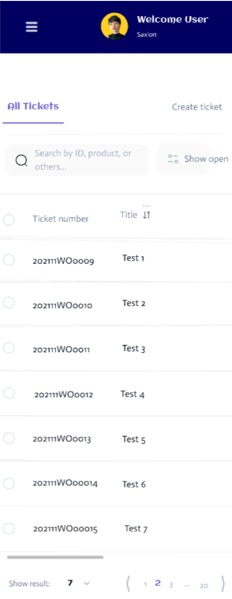
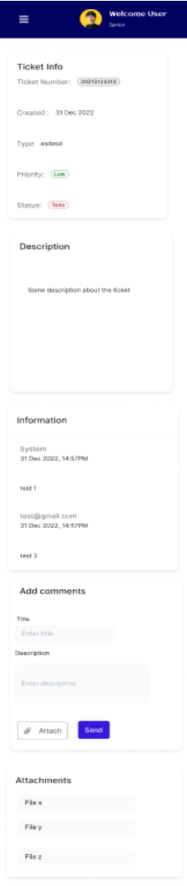
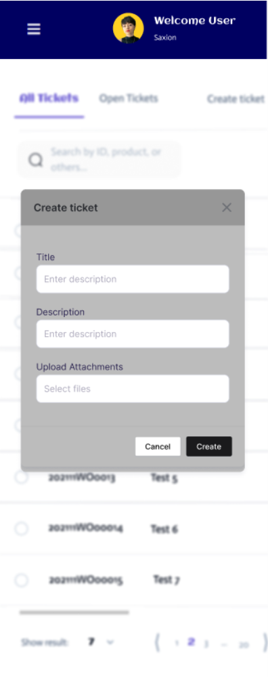

# CUBE Project

## Overview
CUBE is a CRM platform designed to support workflow within companies handling daily ticket resolution. The project uses the Vue.js and Vuetify framework. Also, it uses the OpenID connect protocol for client authentication. This project was initially developed as an educational exercise for Solid Partners, who were so impressed with the outcome that they considered further development for real-world use.

## Team
The project was collaboratively built by a team of six students. Despite their initial unfamiliarity with key technologies, the team successfully delivered a functional and visually appealing product.

## Project Details

### Objective
The primary goal was to develop a beautiful and functional frontend for Solid Partners, leveraging mock APIs provided by the company. Given the multi-tenant nature, it is important to develop a system that effectively manages the various tenants, each managing their own database, while maintaining smooth and efficient operations. Besides this, each tenant will use a personalized customer portal, in terms of
design. The tenants of this produuct are different companies that manages their own internal tickets.

### Features
1. Display real-time information from CUBE Online.
2. Provide customizable styling to match the tenant's house style.
3. Use OpenID Connect for user login.
4. Implement multi-tenancy based on virtual hosting, with the active tenant being selected based on the hostname in the request.

### Challenges and Achievements
- **Learning Curve**: None of the students had prior experience with Vue.js, Vuetify, Cypress, and OpenID Connect . Overcoming this hurdle was a significant achievement.
- **Client Satisfaction**: The client’s enthusiasm for the project indicated a high level of satisfaction, leading to potential real-world application and further development.

## Current Status
Unfortunately, the product cannot be run as the mock APIs were deactivated by Solid Partners, the organization that provided the educational assignment. As a result, we provide visual representations of the project below.

## Visual Frameworks
Below are some images showcasing the visual aspects of the CUBE project:

### Desktop version
#### Login page

#### All available tickets for the employee

#### Edit page of a ticket

#### Create page of a ticket

### Mobile version
#### Login page

#### All available tickets for the employee

#### Edit page of a ticket

#### Create page of a ticket

## Feedback and Contributions

We welcome your feedback and ideas to improve this project! If you have suggestions for new features, improvements, or if you encounter any issues, please let us know. You can contribute by:

- Opening an issue on the [GitHub repository](https://github.com/andreea-cazac/CUBE_customer_portal).
- Submitting a pull request with your improvements or bug fixes.
- Sharing your thoughts or ideas for new games or enhancements.

Your contributions help make this project better for everyone. Thank you for being a part of this educational adventure!
